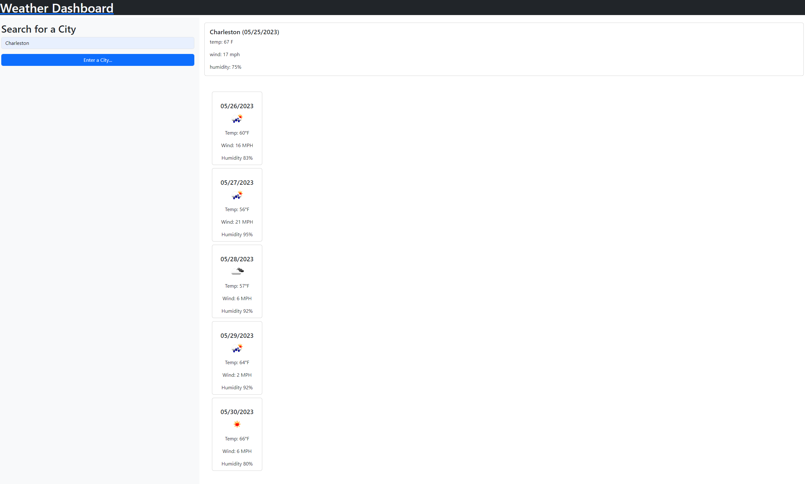

# Weather API

This is a website that takes in weather information to predict travel times. It will tell you the current weather and the futrue forecast for whatever city you type in. 

## User Story

As a user, you will be able to select a city and see the temperature, wind speed, and humidity for the current day and a future forecast up to 5 days.

## Contributing

Id like to include a classmate on here who helped me tremendously in getting this challenge done. Thank you Brady. 

## Links

https://github.com/culinarycam/weather-api

https://culinarycam.github.io/weather-api/

## Screenshot

